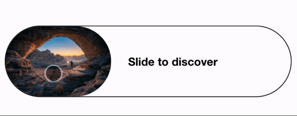

# Installation

`npm install react-slider-button-asweb`

# Example



# Usage

```
import React from "react";
import { Slider } from "react-slide-button-asweb";
import neonImage from "./neon.jpg";

export default function Page() {
  function onSlide() {
    // TODO: implement
  }

  return (
    <Slider
      content="Slide to discover"
      contentAfterSlide="Welcome !"
      onSlide={onSlide}
      imageSrc={neonImage.src}
    />
  );
}
```
